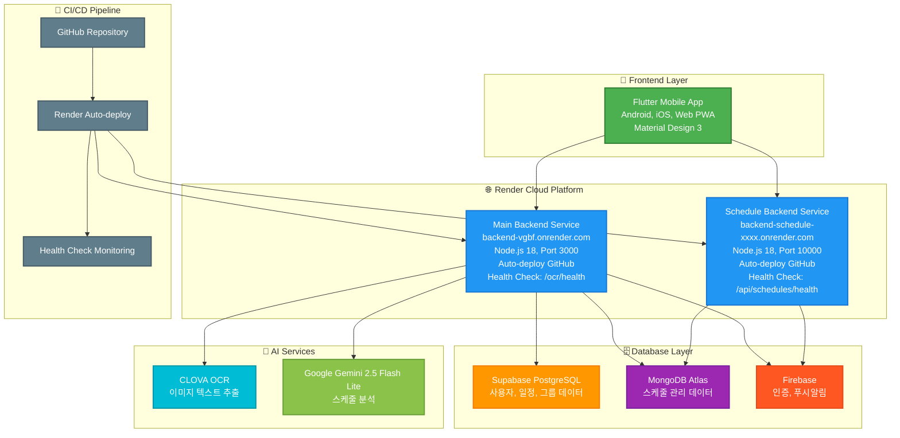
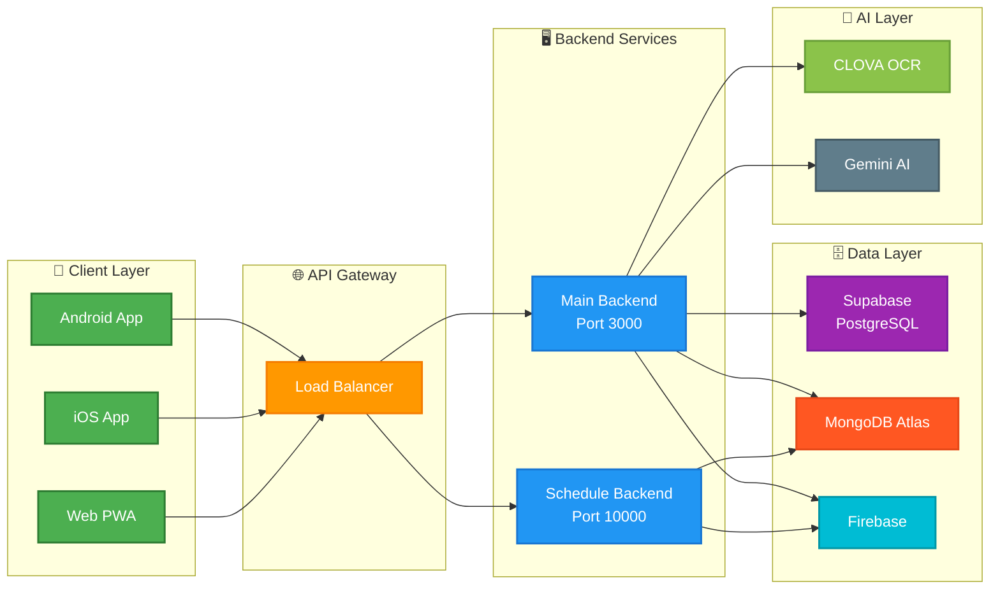
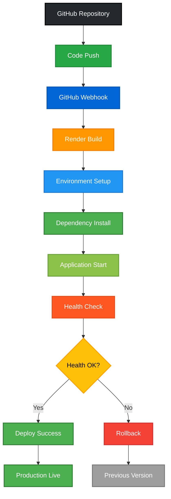

# ALBAMATE 시스템 아키텍처 다이어그램

## 전체 시스템 아키텍처



## 데이터 플로우 다이어그램

```mermaid
sequenceDiagram
    participant F as 📱 Flutter App
    participant R as 🌐 Render Services
    participant S as 🗄️ Supabase
    participant M as 🍃 MongoDB
    participant FB as 🔥 Firebase
    participant C as 📸 CLOVA OCR
    participant G as 🤖 Gemini AI
    
    F->>R: API Request
    R->>S: Database Query
    R->>M: Schedule Data
    R->>FB: Authentication
    R->>C: Image Processing
    C->>G: OCR Result
    G->>R: AI Analysis
    R->>F: Response
    
    Note over F,R: Real-time Communication
    Note over S,M,FB: Data Persistence
    Note over C,G: AI Processing
```

## 마이크로서비스 아키텍처



## 배포 파이프라인

